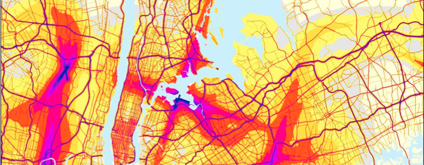

# Sharing Health Data

## Initial Use Case

Preventative medicine and constant health tracking from wearable devices create a shift in the way cities can provide emergency and preventative health care services. Utilizing the ability to track vitals through wearables enables better identification of people at risk during extreme heat or cold, power outages or natural disasters, and helps better route and allocate ambulances and emergency services to hot spots. Better preventative health outcomes and policies can also be achieved through integrated analysis of environmental and personal health data-sets.

### Data and thier Uses

<table>
  <thead>
    <tr>
      <th style="text-align:left">Data Uses</th>
      <th style="text-align:left">Data Needed</th>
      <th style="text-align:left">Data Collection Methods</th>
    </tr>
  </thead>
  <tbody>
    <tr>
      <td style="text-align:left">Provide better emergency response once falls are detected in homes with
        seniors</td>
      <td style="text-align:left">
        <ul>
          <li>user health data</li>
          <li>sensor data to detect falls/impact</li>
          <li>user data</li>
        </ul>
      </td>
      <td style="text-align:left">
        <ul>
          <li>user health data from assisted living or care provider</li>
          <li>motion and impact sensors</li>
          <li>self reported user data</li>
        </ul>
      </td>
    </tr>
    <tr>
      <td style="text-align:left">Preventative care and/or support for seniors, patients at risk of overheating
        or cooling in extreme weather events</td>
      <td style="text-align:left">
        <ul>
          <li>weather & weather forecast data</li>
          <li>in home temperature, humidity, air quality data</li>
          <li>medical device & monitoring data</li>
          <li>user health data</li>
          <li>user data</li>
        </ul>
      </td>
      <td style="text-align:left">
        <ul>
          <li>geospatially referenced weather data feeds</li>
          <li>in-home sensors for temperature, humidity, air quality</li>
          <li>data from patient's medical device & monitors</li>
          <li>user health data from assisted living or care provider</li>
          <li>self reported user data</li>
        </ul>
      </td>
    </tr>
    <tr>
      <td style="text-align:left">Remote monitoring supports aging in places safely and reduces burden of
        health care system</td>
      <td style="text-align:left">
        <ul>
          <li>medical device & monitoring data</li>
          <li>user health data</li>
          <li>user data</li>
          <li>in home temperature, air quality and humidity data</li>
        </ul>
      </td>
      <td style="text-align:left">
        <ul>
          <li>data from patient's medical device & monitors</li>
          <li>user health data from assisted living or care provider</li>
          <li>self reported user data</li>
          <li>in-home sensors for temperature, air quality, humidity</li>
        </ul>
      </td>
    </tr>
  </tbody>
</table>The data needed in this scenario is a combination of personalized data as well as aggregated data of the population. Personal data includes activity tracking, vitals, in-home sensors, medical devices data and health records. With the prevalence of wearables and their increasing sophistication, much of this data can be captured. In this scenario, personal medical equipment and health agencies are able to integrate their systems for deeper insights into the health of the individual. Aggregated population health data can be gathered through personal sources and health agencies to provide demographic trends that can provide more responsive emergency services. Weather and environmental data will be useful in predicting and locating potential problem areas and can be captured by sensors throughout the city.  

There are many potential users of this data.  Health researchers and emergency services will generate benefits for the health and well being of citizens. Citizens themselves will be able to understand their personal health in better ways and make healthier choices. Private institutions, health practitioners, and urban planners can utilize this data to make better decisions of their products, services and patient care.

## How It Works

Health is a case of utmost privacy, and we put the onus on government to take the lead to manage and direct the choices of permissible data use. Government has developed enhanced capabilities to manage the data, provide security and usage access to the trust for improved health outcomes. A hybrid government with citizen jury would be present to further make decisions of the trust, with input from expert academics to provide insights and recommendations based on current and future trends of the industry. A separate government entity would be responsible for enforcement of the civic digital trust's permissible data uses.  

Highly sensitive data, such as personal medical records and information from medical devices would be held directly in trust. Personal health data captured from wearable devices from private organizations will be stored domestically with decentralized integration into the trust.  

## What We Heard

#### Changes to the Trust Model

* A more collaborative approach was recommended by participants.  A collective multistakeholder group of citizens, government and community groups will need to collectively manage the civic digital trust.  
* Citizens would be the driver of the decision making within the trust, with experts informing the decision making process.
* Enforcement needs to have an agency to be a proactive regulatory body.  Policies and legislation are too reactive and an agency would be a method to be able to regulate more effectively.

#### New data and data uses

* Additional data uses were developed that were more future focused.  Precision medicine and health services would be enabled with cross-institution data sharing, where the individual is better known in the health system. [Health incentives](https://9to5mac.com/2018/11/14/free-apple-watch-with-unitedhealthcare/) and preventative health trends would be enabled with both public and private sector integration utilizing step and activity tracking to align fitness goals and promote a healthy lifestyle.
* Anonymized data capture is top-of-mind for the public for aggregated demographic trends and public realm data.    

## Have Your Say



## Summary

We already have a number of health entities that are and/or could be charged with managing access to digital health records. However, most do not include formal, multistakeholder decision making bodies. More thought should be given to how these existing health actors can be better leveraged to meet market needs and/or provide guidance to a potential civic digital trust.

Given that the majority of health sector data is managed by government and public sector entities, some serious thought should be given to whether they have the requisite expertise and capacity to provide the data needed for enabling the emerging digital trust use cases. 

